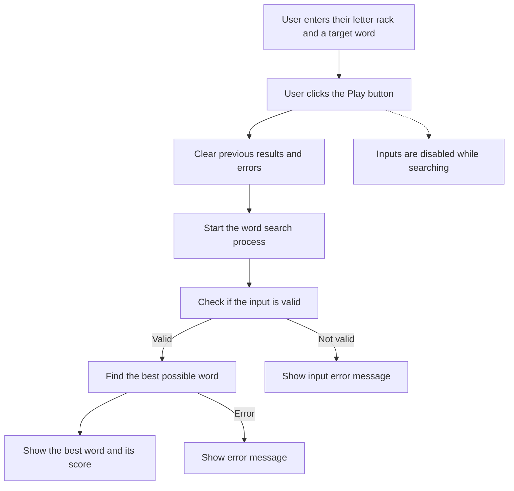

# WOTC Scrabble Word Builder

## Purpose
This application takes in a rack and a word as inputs to generate the best possible word for a Scrabble game based on dictionary of available words (found under `src/assets/dictionary.txt`) as well as some scoring rules for each letter (found under `src/assets/letter_data.json`).

## Techonlogies Used
This app was built using React v19 through Vite (https://vite.dev/).
It also uses TailwindCSS as for styling and utlity classes. (https://tailwindcss.com/)

## Getting Starting

### Pre-Requisites

Please make sure your machine has the following installed:
- Node v22.12 or above
- npm v10 or above (this should come packaged in the latest node version)

### Installation and Startup Steps

Within a terminal application:

- Run `git clone` the project to your local machine and run `cd wotc-srabble-challenge`
- Run `npm install` to install dependencies
- Run `npm run dev` to start the local dev server
- On any browser, visit: http://localhost:5173.

### Assumptions and Design Decisions

The application relies on custom React hooks to function. This app essentially has 3 main components:

- `App.tsx` which is the apps main component. This renders out the inputs and calls the hooks
- `useFindValidation` which runs the validation necessary before the app starts trying to find the best word
- `useFindWord.ts` which is where all the logic to find the word lives

## App Logic Flow

Below is a flowchart representing the main logic flow in the app, using plain English to describe each step:

## Key Assumptions

- In order for a word to be valid, the rack must _always_ be used. 
    - If there is a valid word in the `word` input, however no word can be formed by using the rack, then we show an error.

